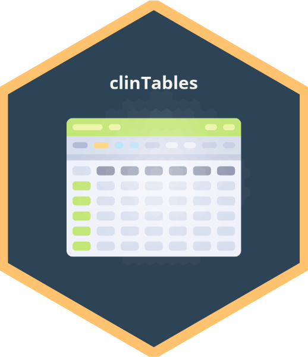

<!-- README.md is generated from README.Rmd. Please edit that file -->

# pharmtables 

<!-- badges: start -->

[](https://github.com/ahasoplakus/pharmtables/actions/workflows/R-CMD-check.yaml)
[](https://lifecycle.r-lib.org/articles/stages.html)
[](https://app.codecov.io/gh/ahasoplakus/pharmtables)
[](https://github.com/ahasoplakus/pharmtables/actions/workflows/styler.yaml)
[](https://github.com/ahasoplakus/pharmtables/actions/workflows/lint.yaml)
[](https://pharmar.github.io/riskmetric/)
<!-- -->


[](https://www.repostatus.org/#active)
[](https://github.com/ahasoplakus/pharmtables/tree/main)
<!-- badges: end -->

## Introduction

**{pharmtables}** is a Shiny Application wrapped as an R package to
visualize some common safety tables used in Clinical Analysis and
Reporting. The application is developed using the
<a href="https://thinkr-open.github.io/golem/" target="_blank">Golem</a>
framework.

## Installation

The development version of the package can be installed using

``` r
remotes::install_github("ahasoplakus/pharmtables", ref = "devel", build_vignettes = TRUE)
```

After installation, the app can be launched locally using

``` r
library(pharmtables)
run_app()
```

List of tables that can be generated using {pharmtables} are

-   Demographic and Clinical Characteristics
-   Patient Disposition
-   Overview of Adverse Events
-   Summary of Adverse Events by System Organ Class and Preferred Term
-   Summary of Adverse Events by System Organ Class and Preferred Term
    and Severity
-   Summary of Concomitant Medications by Medication Class and
    Standardized Medication Name
-   Summary of Medical History by Body System or Organ Class and
    Dictionary-Derived Term
-   Summary of Vital Signs, Laboratory and ECG Tests by Parameter,
    Analysis Value and Visit
-   Shift at post dose for Vital Signs, Laboratory and ECG Tests

<left> Find the app deployed in
<a href="https://sukalpo94.shinyapps.io/pharmtables/" target="_blank">shinyapps.io</a>
and
<a href="https://connect.posit.cloud/ahasoplakus/content/01919355-79eb-347f-660e-0798480b0230" taget="_blank">Posit
Cloud Connect</a> </left>
