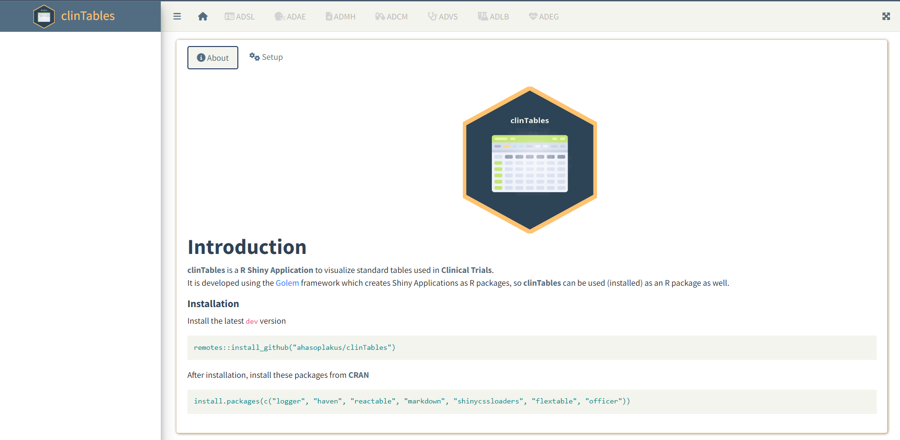
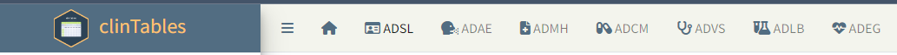
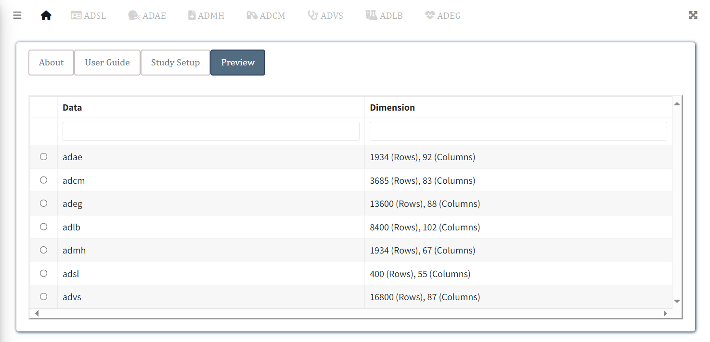
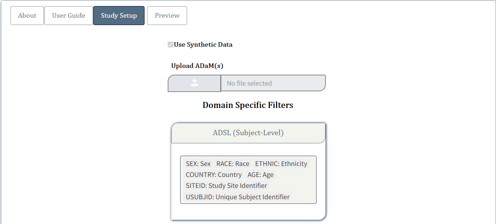
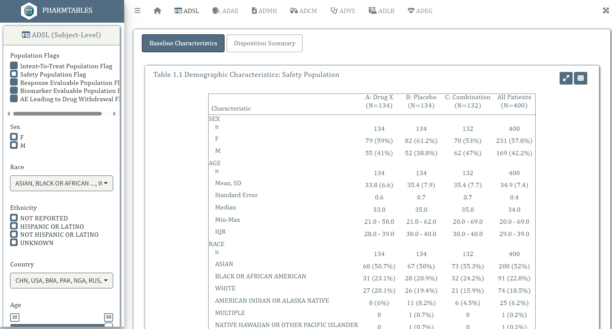
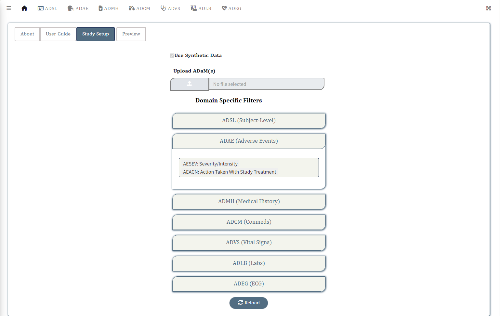
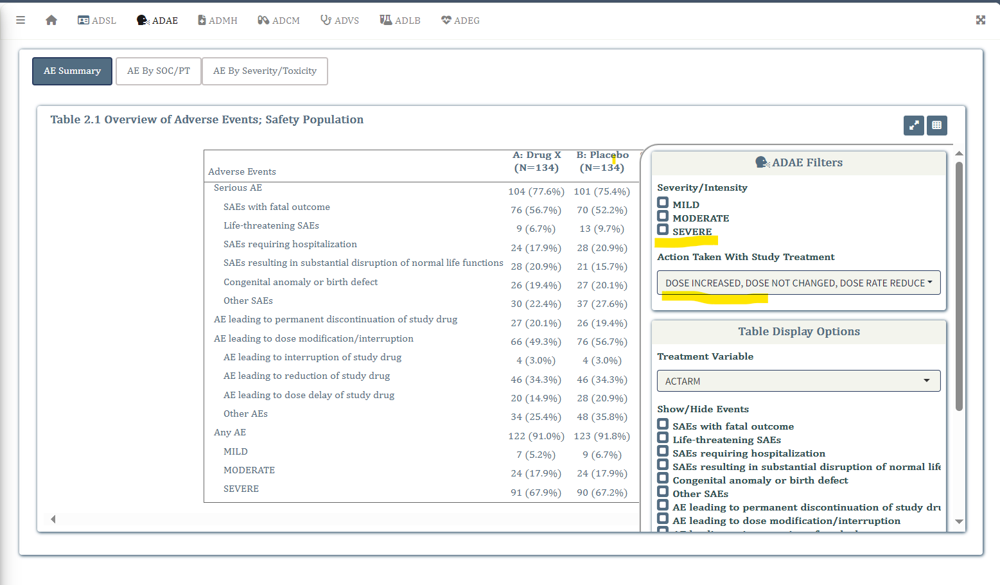

<style type="text/css">
.img-border {
  border-style: outset;
  justify-content: center;
  display: flex;
}

a {
 color: #3BACB6;
}

</style>

# Introduction

This article provides a step-by-step user guide to run the `pharmtables` application.

# Steps
* [Launch application](#launch)
* [Upload/Read in data](#readdata)
* [Preview Data](#preview)
* [Filters Setup](#setup)
* [Run Application](#run)

## Launch application {#launch}


```r
library(pharmtables)
run_app()
```

`run_app()` will launch the application and the application homepage will load.

<div class="img-border">
<div class="figure" style="text-align: center">

</div>
</div>

<br>

## Upload/Read in Data {#readdata}

- Switch to the **Setup** on the Homepage
- Turn on **Load Synthetic Data** if you want to run the application using synthetic data available
within the package
- Click on the **Upload Files** button if you want to load data you want to run the application on.
(Only *sas7bdat* **or** *RDS* formats are accepted)

### Note

The **ADaM** standard datasets listed below are accepted in **pharmtables v0.1.0**

- **adsl**: Subject-Level
- **adae**: Adverse Events
- **adcm**: Concomitant Medications
- **admh**: Medical History
- **advs**: Vital Signs
- **adlb**: Laboratory Analysis
- **adeg**: ECG Examinations

<div class="img-border">
<div class="figure" style="text-align: center">

</div>
</div>

Each of the domain specific reports can be accessed by the  tabs placed in the navigation panel 
at the top of the application.

<div class="img-border">
<div class="figure" style="text-align: center">

</div>
</div>

<br>

## Preview Data {#preview}

Once the datasets have been read, the **Preview** button is enabled.

<div class="img-border">
<div class="figure" style="text-align: center">

</div>
</div>

<br>

Click on the **Preview** button to quickly glance through the data sets that have been added
for analysis. A modal window will pop up displaying the names of data sets loaded in a 
tabular format. Click on the expand button to view a specific data set.

<br>

<div class="img-border">
<div class="figure" style="text-align: center">

</div>
</div>

<br>

## Filters Setup {#setup}

* ### ADSL Filters

  * Expand the **ADSL Filters** pill beneath the **Preview** button to add/remove any **adsl** 
    specific variables to be added as filters. By default *SEX*, *RACE*, *ETHNIC*, *AGE*, 
    *SITEID* and *USUBJID* variables are selected.
  * At least one of the **adsl** variables need to be selected as a filter for the 
    application to work.

<div class="img-border">
<div class="figure" style="text-align: center">

</div>
</div>

<br>

  * **ADSL Filters** appears in the left sidebar <b>once the application is run</b>
    and can be applied to filter all domain specific reports.

<div class="img-border">
<div class="figure" style="text-align: center">

</div>
</div>

<br>

* ### Domain Specific (ADxx) Filters

  * Expand the pills corresponding to each domain (ADAE, ADVS etc) to add/remove the domain
    specific variables to be added as filters. Here is an example for **ADAE** specific filters,
    where **AESEV** and **AEACN** have been added as filters for all **ADAE** related reports.

<div class="img-border">
<div class="figure" style="text-align: center">

</div>
</div>

<br>

  * **ADAE Filters** will appear over the **Table Display Options** within the Filter window 
  for all **ADAE** related reports, once the application is run. (Click on the 
   icon to open the filter window)
  
<div class="img-border">
<div class="figure" style="text-align: center">

</div>
</div>

<br>

## Run Application {#run}

Finally, run the application by clicking on the **Run** button.

<div class="img-border">
<div class="figure" style="text-align: center">

</div>
</div>

**Note:** *All examples assume CDISC SDTM and/or ADaM format as input unless otherwise specified.*
