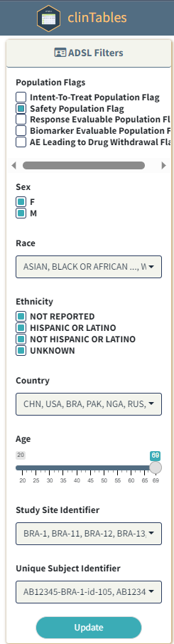
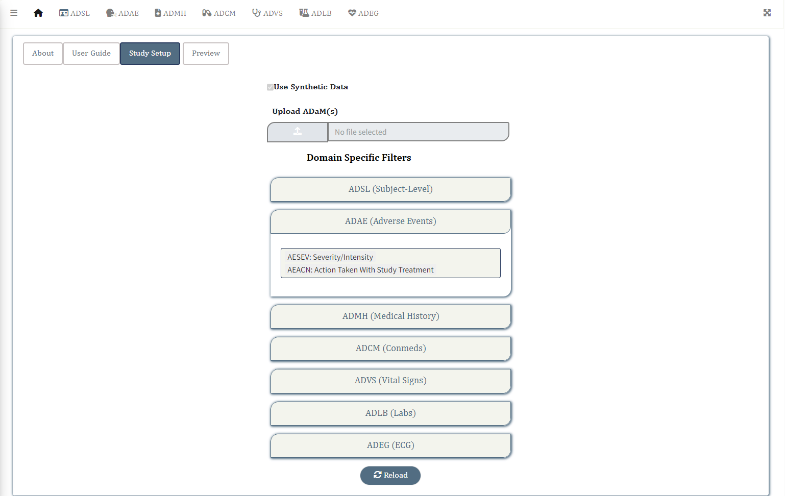
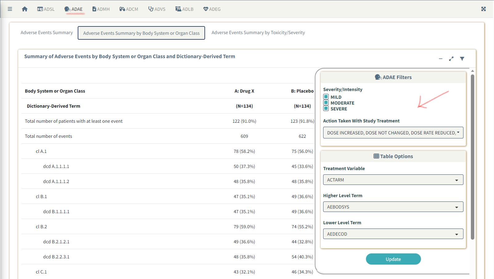

# Upload/Read in Data

-   Switch to the **Study Setup** tab
-   Select **Use Synthetic Data** if you want to run the application
    using synthetic data sets available in the package
-   Select **Upload ADaM(s)** button to load external ADaM data sets.
    (Only *sas7bdat* **or** *RDS* formats are accepted)

The following CDISC Standard **ADaM** datasets are compatible with this
version

-   **adsl**: Subject-Level
-   **adae**: Adverse Events
-   **adcm**: Concomitant Medications
-   **admh**: Medical History
-   **advs**: Vital Signs
-   **adlb**: Laboratory Analysis
-   **adeg**: ECG Examinations

# Preview Data

Once the data sets are uploaded, the **Preview** tab is enabled. Switch
to the same to quickly glance through the list of data sets.

 

# Setup Filters

## Subject-Level Filters

-   Expand the **ADSL** navigation pill under **Domain Specific
    Filters** and select the name(s) of **ADSL** variables from the
    dropdown to enable subject-level filtering of all tables. By default
    *SEX*, *RACE*, *ETHNIC*, *AGE*, *SITEID* and *USUBJID* variables are
    chosen (At least one needs to be selected).

 

-   **ADSL** filters appears at the left sidebar of the app, under
    **Population Flags** filter.

 

## Domain Specific Filters

-   Expand the navigation pills corresponding to each domain (ADAE, ADVS
    etc) and select the name(s) of domain specific variables to be added
    as filters. Here is an example for **ADAE** specific filters, where
    **AESEV** and **AEACN** have been added as filters for all **ADAE**
    related reports.

 

-   Reload the app and check the selected variables from **ADAE** appear
    as filters over the **Table Display Options** within the filter box
    for all **ADAE** related reports. (Click on the
    <i class="fas fa-table-cells" role="presentation" aria-label="table-cells icon"></i>
    icon to access the filter box)

