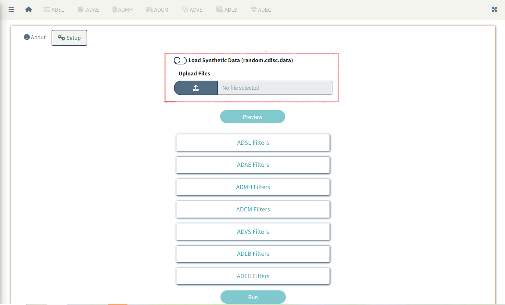

```{r, include = FALSE}
knitr::opts_chunk$set(
  collapse = TRUE,
  comment = "#>",
  out.width = "97%"
)
```

# Introduction

This article provides a step-by-step user guide to run the `clinTables` application.

# Steps
* [Launch application](#launch)
* [Upload/Read in data](#readdata)
* [Preview Data](#preview)
* [ADSL Filters](#adsl)
* [Domain Specific Filters](#domain)
* [Table Options](#tableopt)
* [Analysis Flags](#analysisflag)

## Launch application {#launch}

```{r, eval=FALSE}
library(clinTables)
run_app()
```


## Upload/Read in Data {#readdata}

- Switch to the **Setup** tab beside the **About** tab on Homepage
- Click on **Load Synthetic Data** if you want to run the application using synthetic data available
within the package
- Click on the **Upload Files** button if you want to load data you want to run the application on.
(Only *sas7bdat* **or** *RDS* formats are accepted)



**Note:** *All examples assume CDISC SDTM and/or ADaM format as input unless otherwise specified.*
