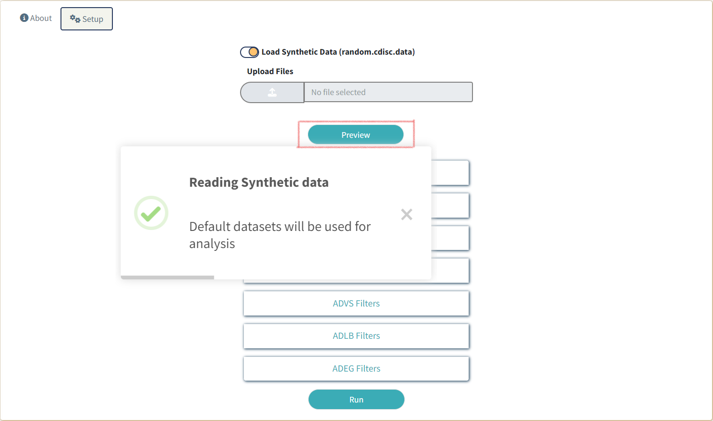
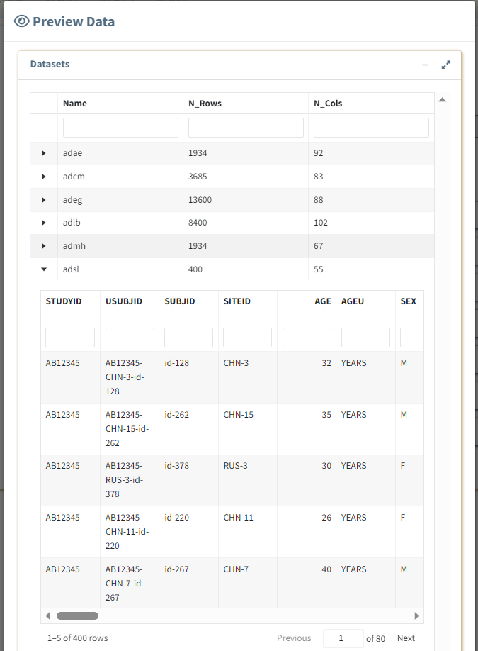
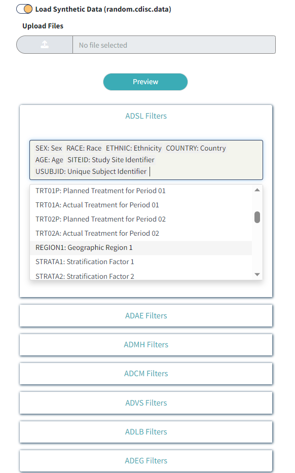

```{r, include = FALSE}
knitr::opts_chunk$set(
  collapse = TRUE,
  comment = "#>",
  out.width = "97%",
  fig.align = "center"
)
```

```{css, echo=FALSE}
.img-border {
  border-style: outset;
}
```

# Introduction

This article provides a step-by-step user guide to run the `clinTables` application.

# Steps
* [Launch application](#launch)
* [Upload/Read in data](#readdata)
* [Preview Data](#preview)
* [Filters Setup](#setup)

## Launch application {#launch}

```{r, eval=FALSE}
library(clinTables)
run_app()
```

`run_app()` will launch the application and the application homepage will load.

<div class="img-border">
```{r, echo=FALSE}
knitr::include_graphics("../man/figures/home.png")
```
</div>

## Upload/Read in Data {#readdata}

- Switch to the **Setup** tab beside the **About** tab on Homepage
- Turn on **Load Synthetic Data** if you want to run the application using synthetic data available
within the package
- Click on the **Upload Files** button if you want to load data you want to run the application on.
(Only *sas7bdat* **or** *RDS* formats are accepted)

### Note

Only following **ADaM** standard datasets are accepted

- **adsl**: Subject-Level
- **adae**: Adverse Events
- **adcm**: Concomitant Medications
- **admh**: Medical History
- **advs**: Vital Signs
- **adlb**: Laboratory Analysis
- **adeg**: ECG Examinations

<div class="img-border">
```{r, echo=FALSE}
knitr::include_graphics("../man/figures/readin.png")
```
</div>

## Preview Data {#preview}

Once the datasets have been read, the **Preview** button is enabled.

<div class="img-border">
```{r, echo=FALSE}

```
</div>

<br>

Click on the **Preview** button to quickly glance through the data sets that have been added
for analysis. A modal window will pop up displaying the names of data sets loaded in a tabular format.
Click on the expand button to view a specific data set.

<br>

<div class="img-border">
```{r, echo=FALSE}

```
</div>

<br>

## Filters Setup {#setup}

### ADSL Filters

Expand the **ADSL Filters** pill beneath the **Preview** button to add/remove any **adsl** specific 
variables you want to filter *all* reports with. By default *SEX*, *RACE*, *ETHNIC*, *AGE*, 
*SITEID* and *USUBJID* variables are selected.

<div class="img-border">
```{r, echo=FALSE}

```
</div>

**Note:** *All examples assume CDISC SDTM and/or ADaM format as input unless otherwise specified.*
