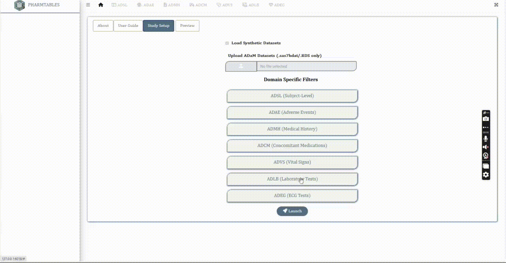

```{r, include = FALSE}
knitr::opts_chunk$set(
  collapse = TRUE,
  comment = "#>",
  out.width = "97%",
  fig.align = "center"
)
```

```{css, echo=FALSE}
.img-border {
  border-style: outset;
  justify-content: center;
  display: flex;
}
```

```{css, echo=FALSE}
a {
  color: #3BACB6;
}
```

# Upload/Read and Preview{#readdata}

- Switch to the **Study Setup** tab
- Select **Use Synthetic Data** if you want to run the application using synthetic data sets available in the package
- Select **Upload ADaM(s)** button to load external ADaM data sets. (Only *sas7bdat* **or** *RDS* formats are accepted)

The following CDISC Standard **ADaM** datasets are compatible with this version

- **adsl**: Subject-Level
- **adae**: Adverse Events
- **adcm**: Concomitant Medications
- **admh**: Medical History
- **advs**: Vital Signs
- **adlb**: Laboratory Analysis
- **adeg**: ECG Examinations

Once the data sets are uploaded, the **Preview** tab is enabled. Switch to the same to quickly glance through the list of data sets.

<div class="img-border">
```{r prev_data, echo=FALSE}
knitr::include_graphics("../man/figures/prev_data.gif")
```
</div>

<br>

# Setup Filters {#setup}

## Subject-Level Filters

- Expand the **ADSL** navigation pill under **Domain Specific Filters** and select the name(s) of **ADSL** variables from the dropdown to enable subject-level filtering of all tables across <b>all domains</b>. By default *SEX*, *RACE*, *ETHNIC*, *AGE*, *SITEID* and *USUBJID* variables are chosen (At least one needs to be selected).

- **ADSL** filters appears at the left sidebar of the app, under **Population Flags** filter.

<div class="img-border">
```{r adsl, echo=FALSE, dpi=300}

```
</div>

<br>

## Domain Specific Filters

- Expand the navigation pills corresponding to each domain (ADAE, ADVS etc) and select the name(s) of domain specific variables to be added as filters. Here is an example for **ADAE** specific filters, where **AESEV** and **AEACN** have been added as filters for all **ADAE** related reports.

<br>

- Reload the app and check the selected variables from **ADAE** appear as filters over the **Table Display Options** within the filter box for all **ADAE** related reports. (Click on the `r shiny::icon("table-cells")` icon to access the filter box)

<div class="img-border">
```{r adae_filters, echo=FALSE}
knitr::include_graphics("../man/figures/dom_filt.gif")
```
</div>

